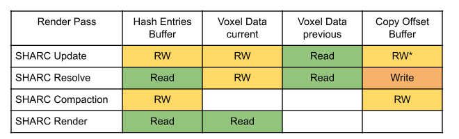
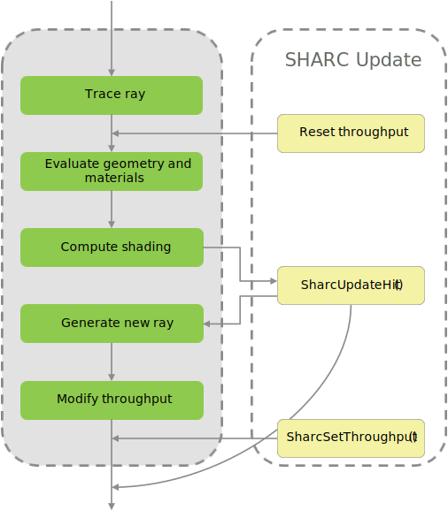
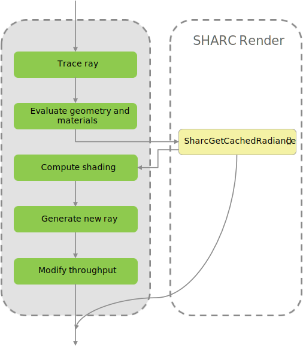

# SHaRC Integration Guide

SHaRC algorithm integration doesn't require substantial modifications to the existing path tracer code. The core algorithm consists of two passes. The first pass uses sparse tracing to fill the world-space radiance cache using existing path tracer code, second pass samples cached data on ray hit to speed up tracing.

<p style="text-align: center">
</img>
</img>
<em>Image 1. Path traced output at 1 path per pixel left and with SHaRC cache usage right</em>
</p>

## Integration Steps

An implementation of SHaRC using the RTXGI SDK needs to perform the following steps:

At Load-Time

Create main resources:
* `Hash entries` buffer - structured buffer with 64-bits entries
* `Voxel data` buffer - stores accumulated radiance and sample count, use 128-bits per entry, RAW buffer. Two instances are used to store current and previous frame data
* `Copy offset` buffer - structured buffer with 32-bits per entry used for data compaction

The number of entries in each buffer should be the same, it represents the number of scene voxels used for radiance caching. A solid baseline for most scenes can be the usage of $2^{22}$ elements.

At Render-Time

* **Populate cache data** using sparse tracing against the scene
* **Combine old and new cache data**, perform data compaction
* **Perform tracing** with early path termination using cached data

## Hash Grid Visualization

`Hash grid` visualization itself doesn’t require any GPU resources to be used. The simplest debug visualization uses world space position derived from the primary ray hit intersection.

```C++
GridParameters gridParameters;
gridParameters.cameraPosition = g_Constants.cameraPosition;
gridParameters.logarithmBase = SHARC_GRID_LOGARITHM_BASE;
gridParameters.sceneScale = g_Constants.sharcSceneScale;

float3 color = HashGridDebugColoredHash(positionWorld, gridParameters);
```

<p style="text-align: center">
</img>
</img>
<em>Image 2. SHaRC hash grid vizualization</em>
</p>

Logarithm base controls levels of detail distribution and voxel size ratio change between neighboring levels, it doesn’t make voxel sizes bigger or smaller on average. To control voxel size use ```sceneScale``` parameter instead.

## Implementation Details

### Render Loop Change

Instead of the original trace call, we should have the following four passes with SHaRC:

* SHaRC update - updates the cache with the new data on each frame. Requires `SHaRC_UPDATE 1` shader define
* SHaRC resolve - combines new cache data with data obtained on the previous frame
* SHaRC hash copy - the second step of the resolve pass required for data compaction
* SHaRC render/query - trace scene paths with early termination using cached data. Requires `SHARC_QUERY 1` shader define

### Resource Binding

The SDK provides shader-side headers and code snippets that implement most of the steps above. Shader code should include [SharcCommon.h](../Shaders/Include/SharcCommon.h) which already includes [HashGridCommon.h](../Shaders/Include/HashGridCommon.h)

<p style="text-align: center">
</img>
</p>

*Buffer is used if SHARC_ENABLE_64_BIT_ATOMICS is set to 0

Each pass requires appropriate transition/UAV barries to wait for the previous stage completion.

### SHaRC Update

Pass requires `SHARC_UPDATE 1` shader define.

This pass runs a full path tracer loop for a subset of screen pixels with some modifications applied. We recommend starting with random pixel selection for each 5x5 block to process only 4% of the original paths per frame. This typically should result in a good data set for the cache update and have a small performance overhead at the same time. Positions should be different between frames, producing whole-screen coverage over time. Each path segment during the update step is treated individually, this way we should reset path throughput to 1.0 and accumulated radiance to 0.0 on each bounce. For each new sample(path) we should first call `SharcInit()`. On a miss event `SharcUpdateMiss()` is called and the path gets terminated, for hit we should evaluate radiance at the hit point and then call `SharcUpdateHit()`. If `SharcUpdateHit()` call returns false, we can immediately terminate the path. Once a new ray has been selected we should update the path throughput and call `SharcSetThroughput()`, after that path throughput can be safely reset back to 1.0.

<p style="text-align: center">

<em>Figure 1. Path tracer loop during SHaRC update</em>
</p>

### SHaRC Render

Pass requires `SHARC_QUERY 1` shader define.

During rendering with SHaRC cache usage we should try obtaining cached data using `SharcGetCachedRadiance()` on each hit except the primary hit if any. Upon success, the path tracing loop should be immediately terminated.

<p style="text-align: center">

</p>

To avoid potential rendering artifacts certain aspects should be taken into account. If the path segment length is less than a voxel size(checked using `GetVoxelSize()`) we should continue tracing until the path segment is long enough to be safely usable. Unlike diffuse lobes, specular ones should be treated with care. For the glossy specular lobe, we can estimate its "effective" cone spread and if it exceeds the spatial resolution of the voxel grid then the cache can be used. Cone spread can be estimated as:

$$2.0 * ray.length * sqrt(0.5 * a^2 / (1 - a^2))$$
where `a` is material roughness squared.

## Memory usage

```Hash entries``` buffer, two ```Voxel data``` and ```Copy offset``` buffers totally require 352 (64 + 128 * 2 + 32) bits per voxel. For $2^{22}$ cache elements this will require ~185 MBs of video memory. Total number of elements may vary depending on the voxel size and scene scale. Larger buffer sizes may be needed to reduce potential hash collisions.
